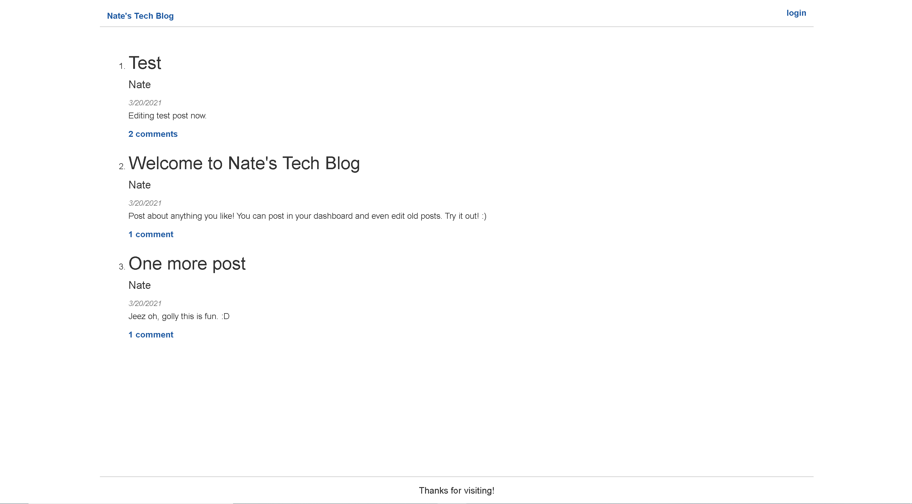
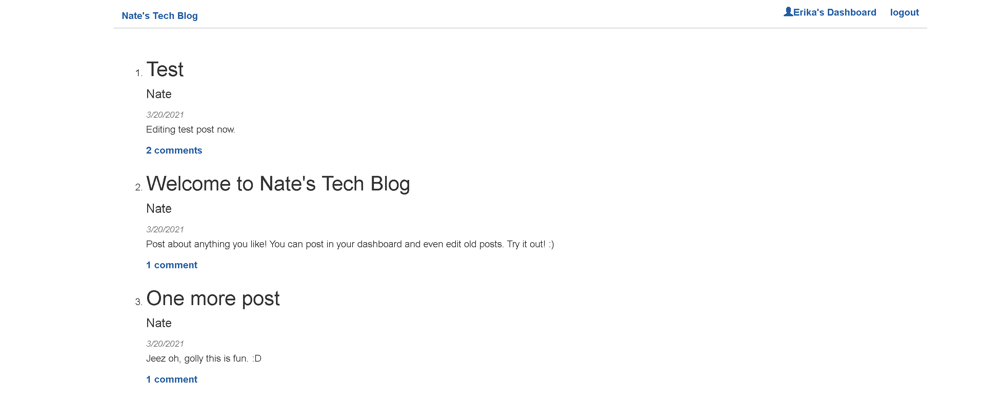
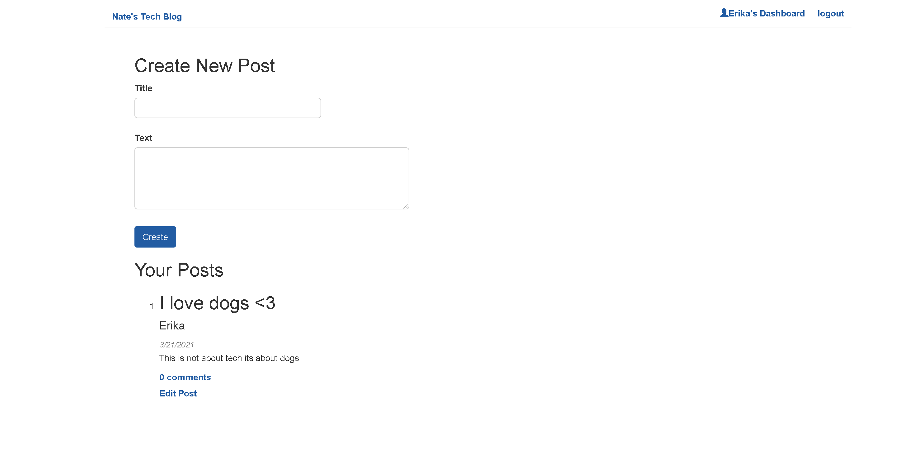
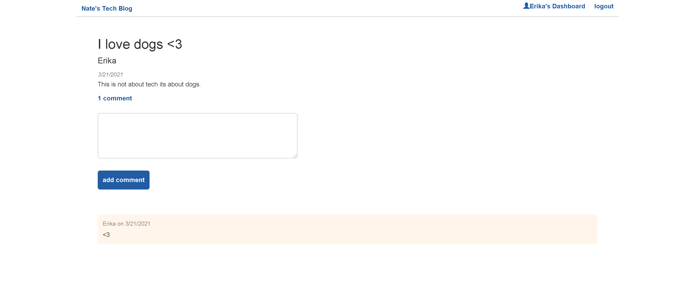
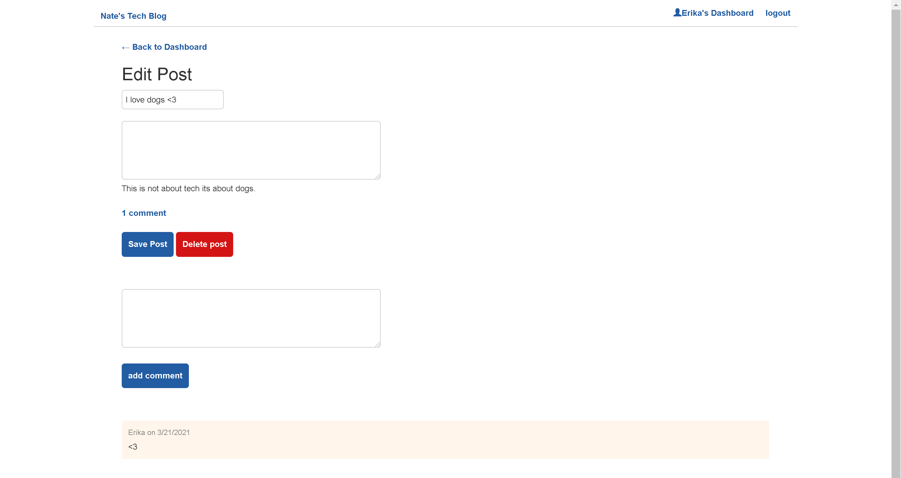

# MVC Tech Blog

## Description
This application was created using Node.js, express for the server, and sequelize to connect to a mysql database entitled "tech_blog_db".  All user, post, and comment data is stored in tech_blog_db.  The live app is currently deployed on Heroku, using the JAWSDB add on to store data.  All passwords have been encrypted using the bcrypt Node.js package.  The HTML views templates are generated using Handlebars.js.

Homepage Logged Out:

Homepage Logged In:

Dashboard:

Single Post with Comments:

Edit Post:

